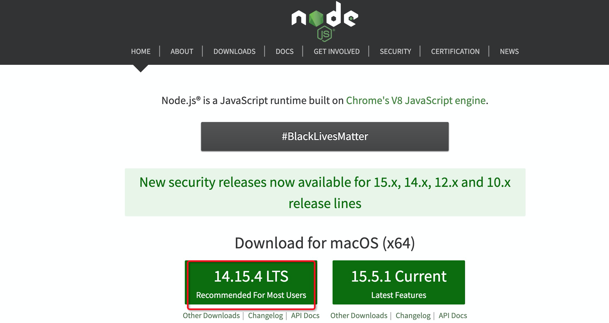
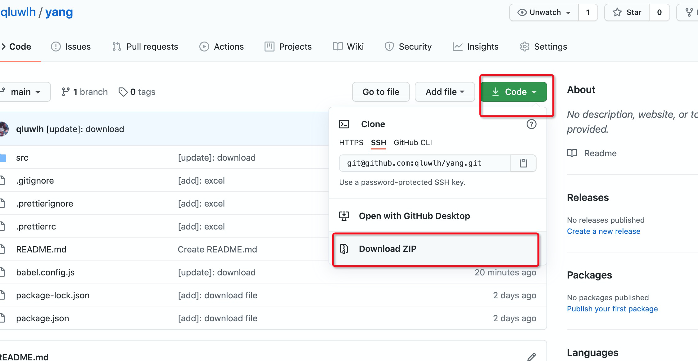
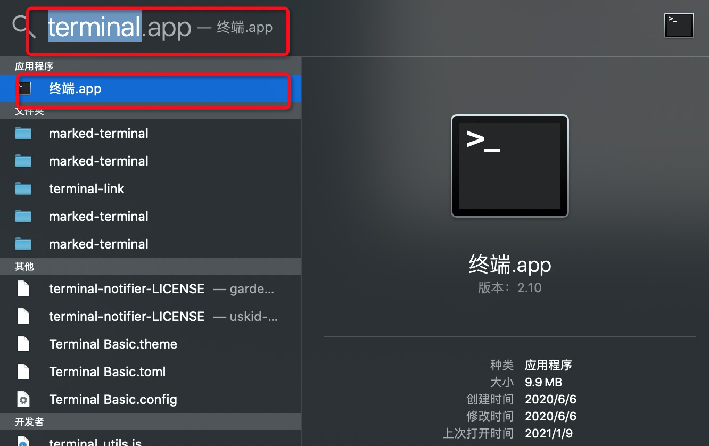
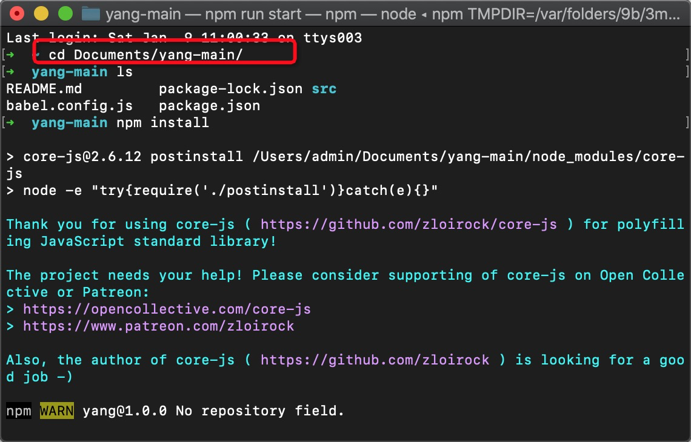
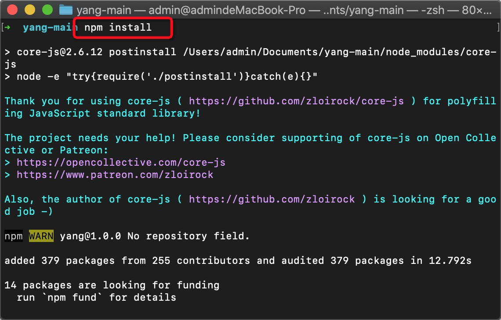
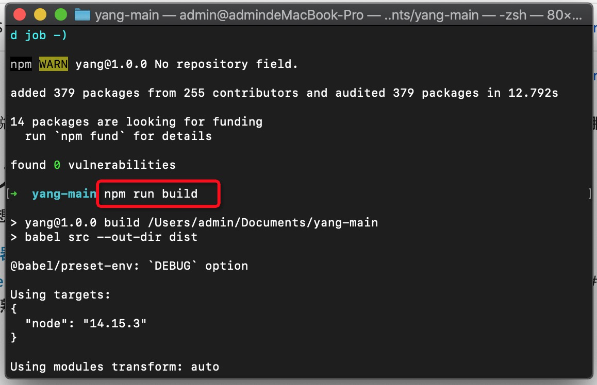
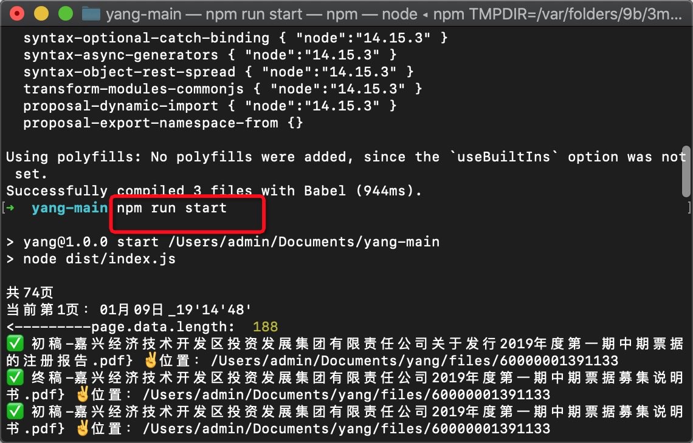

# yang同学下载数据专用
## 下载 [Nodejs](https://nodejs.org/en)


## 下载 [代码](https://github.com/qluwlh/yang) 到文稿(Documents)目录下

## 打开终端
```shell
cmd + 空格键 打开搜索terminal，并打开，如下图
```

## 执行脚本
依次输入执行
```shell
cd Documents/yang-main/
```

```shell
npm install
```

```shell
npm run build
```

```shell
npm run start
```


## 注意
鉴于下载内容较多，有数小时之久，请保证如下：
* 磁盘空间充足
* 电量充足，并且中途不能进入休眠状态
* 网络畅通，执行脚本过程中关闭vpn
* 不要中途关闭终端
  